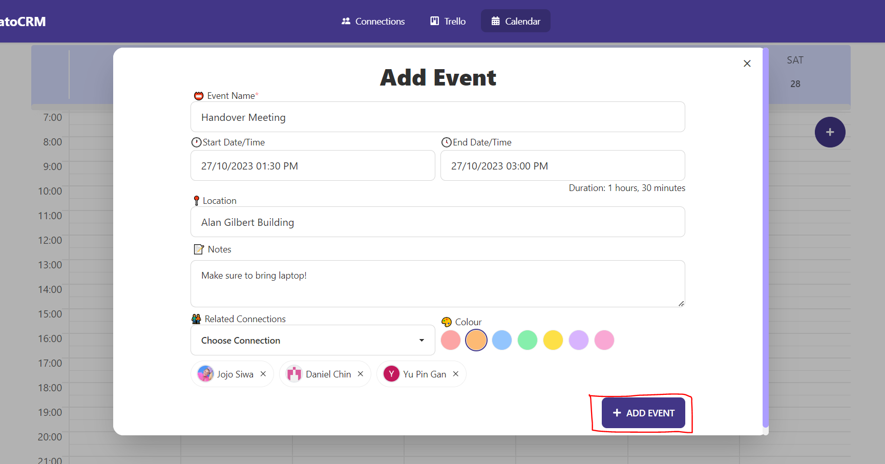
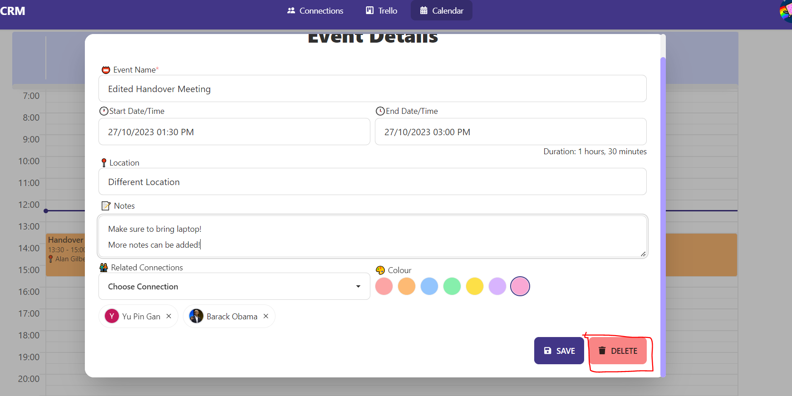
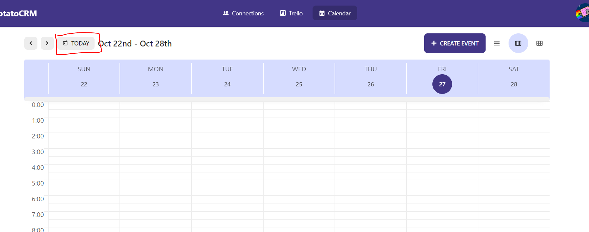

# Calendar

> [Back to User Guide](/docs/)
>
> ❓ For FAQ, please refer to [FAQ](/docs/faq.md)

## Overview

## Creating an Event

1. Click on the "Create Event" botton on the top right of the screen
   - 
   - 
     - On smaller screens or if you have scrolled down, you can click on the `+` icon on the top right of the screen
2. Enter the relevant details
   - Event Name (mandatory)
   - Start Date/Time & End Date/Time (recommended)
   - Location
   - Notes
   - Connections
   - Event Colour
   - 
3. Click on the "Add Event" button at the bottom right of the pop-up

## Editing an Event

1. Click on the event you intend to edit
2. Change the fields you with to edit
   - 
3. Click on the "Save" button at the bottom right of the pop-up

## Deleting an Event

1. Click on the event you intend to delete
   - 
2. Click on the "Delete" button at the bottom right of the pop-up

## Changing Visual Mode (Day/Week/Month)

- Click on the relevant buttons on the top-left of the screen
  - 
- Alternatively, press the 'd', 'w' & 'm' keys on your keyboard to switch between day, week & months

## Reset Visual Mode to Today

- Click on the 'today' button on the top-left of the screen
  - 
- Alternatively, press the 't' key on your keyboard

## Keyboard Shortcuts

- `t` - Reset Visual Mode to Today
- `m` - Switch to Month View
- `w` - Switch to Week View
- `d` - Switch to Day View
- `<-` - Go to Previous Day/Week/Month
- `->` - Go to Next Day/Week/Month