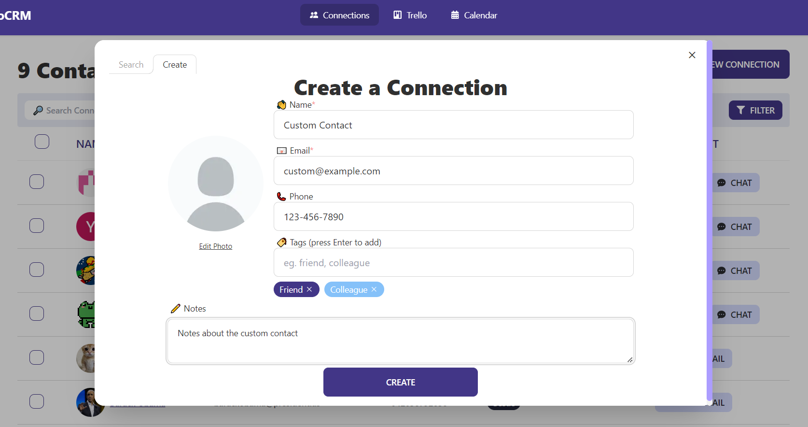
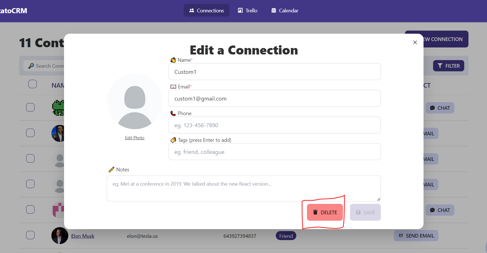
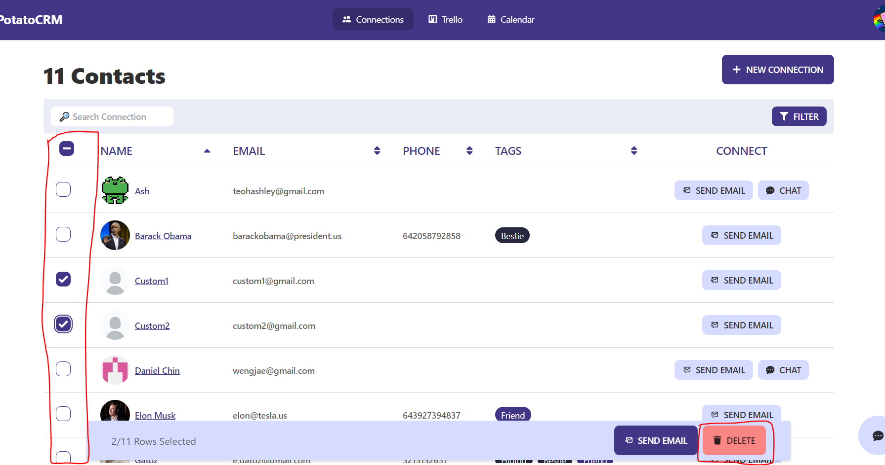
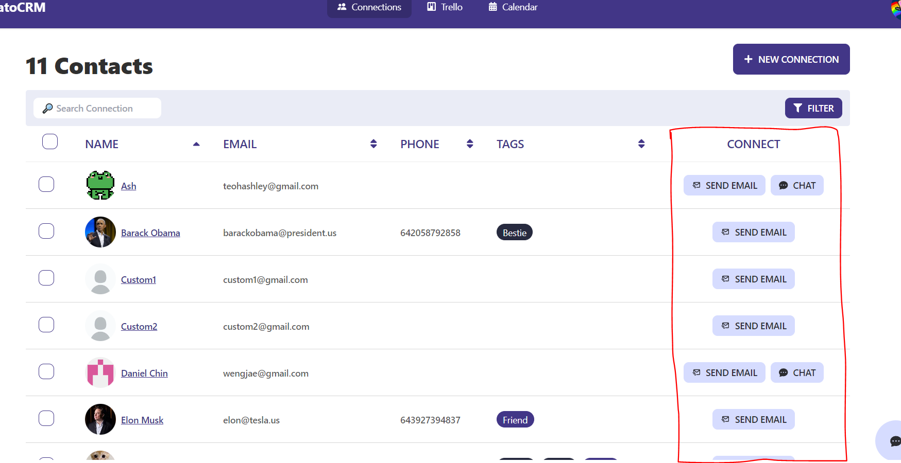
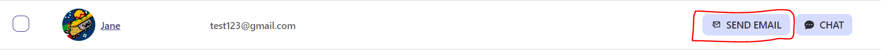
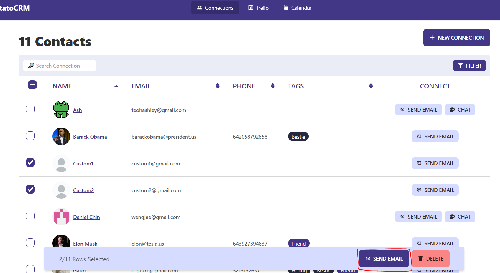

# Connections

> [Back to User Guide](/docs/)
>
> ❓ For FAQ, please refer to [FAQ](/docs/faq.md)

## Creating a connection

### With an Existing User

1. Click on the "New Connection" button on the top right of the screen
   - 
2. Under the "Search" tab, enter the connection's email
   - 
3. Click on the "Connect" button with the desired user

### With Custom Input

1. Click on the "New Connection" button on the top right of the screen
   - 
2. Under the "Create" tab, enter the relevant details
   - Name
   - Email
   - Location
   - Image, Phone, Tags, Notes (optional)
   * 
3. Click on the "Create" button at the bottom

## Viewing and Editing a Connection's details

> NOTE: you are not able to edit the details of an existing user
>
> - check out the [FAQ > I can't edit a Connection's Details](/docs/faq.md#i-cant-edit-a-connections-details) for more information

1. Click on the name of the connection you intend to edit
2. Change the fields you want to edit (You can only edit tags and notes for existing users)
3. Click on the "Save" button at the bottom right of the pop-up

## Deleting a Connection

1. Click on the name of the connection you intend to delete
2. Click on the "Delete" button at the bottom right of the pop-up

## Deleting multiple Connections

1. Click on the checkbox of the connections you intend to delete
2. Click on the "Delete" button on the bottom right of the screen

## Communicating with a Connection

### Through Email

> Email is available for all connections
> 

1. Click on the "Send Email" button in the connection's row
   - 
2. This will open the mail app with a draft email your connection

### Through the Chat Function

> Chat is only available for connections that have signed up for an account on the platform
> 

1. Click on the "Chat" button in the connection's row
   - 
2. This will open a chat window with your connection at the bottom right. You can now start chatting with your connection!
   - 

- You can also use the chat button on the bottom right of the screen to chat with all your connections

1. Click on the "Chat" button on the bottom right of the screen
   - 
2. Select the connection you want to chat with from the dropdown menu
   - 
3. Start chatting with your connection
   - 

### Send Multiple Emails

1. Click on the checkbox of the connections you intend to send emails to
2. Click on the "Send Email" button on the bottom right of the screen
3. This will open the mail app with to all your selected connections as recipients
