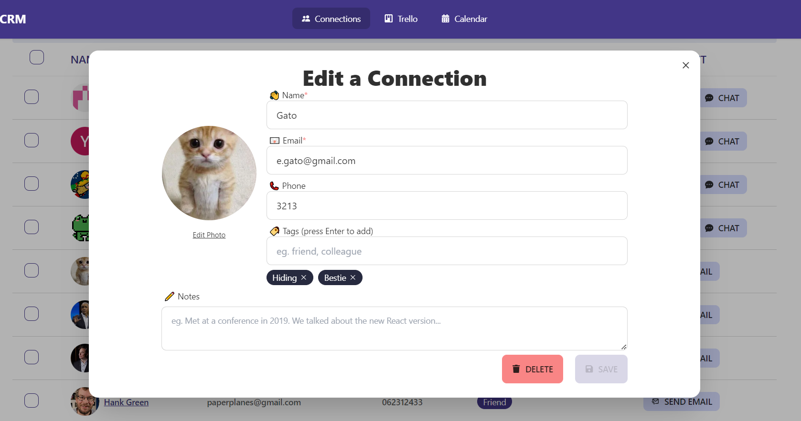

# Frequently Asked Questions

> [Back to User Guide](/docs/)

## Oh No! I get a pop-up suggesting a strong password but it doesn't satisfy the password requirements!

- Not to worry dear user, you have not broken our Sign Up page. Some browsers have extra features that give suggestions for password creation and password management.
  - 
- For instance, Chrome's default password generator does not satisfy our password requirements as it does not include special characters.
  - 
- To fix this, just add a special character (or whatever other characters necessary) to the password to satisfy all requirements.
- Although there is conflicting research on the effectiveness of imposing password requirements, we have decided to implement them as a security measure.
  - Note that even Google has password strength requirements for their accounts that suggest a password length of at least 8 characters and they also recommend a mix of letters, numbers and symbols.
    - 
  - So if you have any further issues with our password requirements, please take it up with Google or you can request for an apology letter from the team [here](https://www.youtube.com/watch?v=dQw4w9WgXcQ&pp=ygUJcmljayByb2xs).

## I forgot my password, how do I reset it?

- There are two ways to change your password,
  1. If you are already logged in and would like to change your password, please refer to the following document: [Forgot Password](auth.md#forgot-password)
  2. If you are not logged in and forgot your password, please refer to the following document: [Change Password](auth.md#change-password)

## I can't edit a connection's details!

- There are two types of connections:

  1. [Existing Users](connections.md#with-an-existing-user)
     - 
     * These are users that have signed up for an account on the platform.
     * you will not be able to edit their details (ie. Name, Email, Phone and Profile Picture) as they are managed by the user themselves.
     * You are, however, able to edit their Tags and Notes as they are managed by you.
  2. [Custom Connections](connections.md#with-custom-input)
     - 
     * These are connections that you have created yourself.

- If you would like to edit the user's details, you will have to [delete the connection](connections.md#deleting-a-connection) and [create a custom connection](connections.md#with-custom-input) instead of adding an existing user with the same details.

## The chat is showing that I am disconnected!

- Sometimes the chat service we use may disconnect you from the chat server. This is usually due to inactivity or a bad connection.
- Just click on the `Disconnected` button and it will reconnect you to the chat server.
- You can also try to refresh the page to reconnect to the chat server.

## Other Issues

- To report any other issues, please create an issue on our [GitHub repository](https://github.com/chuahxinyu/comp30022/issues) with as much detail as possible.
